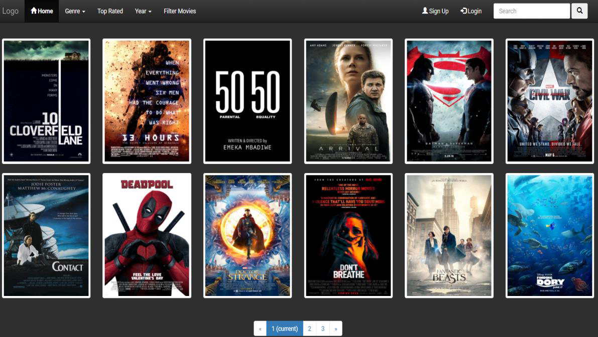
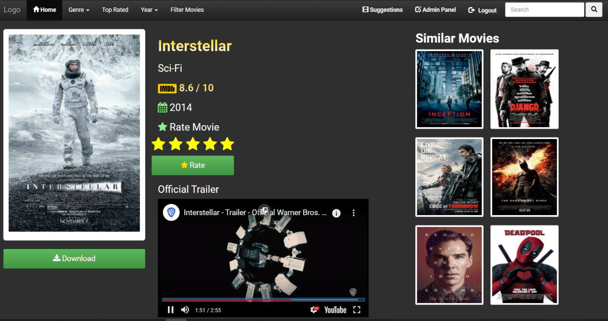
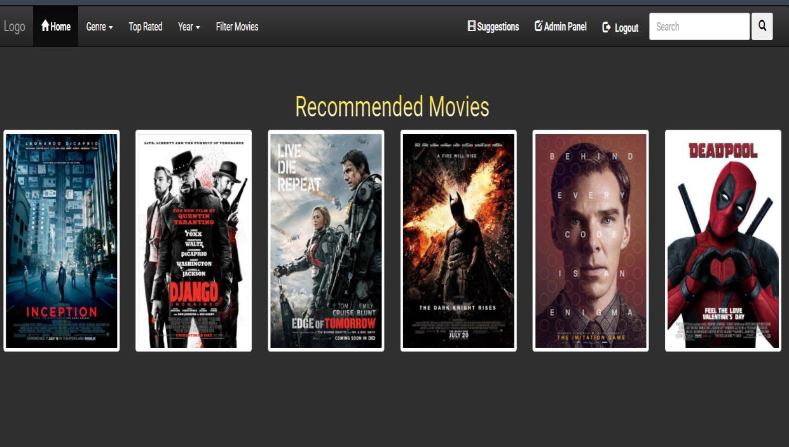

# 🎬 Movie Recommendation System

A web-based **Movie Recommendation System** developed as a Bachelor's degree project using **Item-Based Collaborative Filtering**.

The system recommends similar movies based on users' movie rating patterns. The **Pearson Correlation Coefficient** is used to measure the similarity between movies.

## 🛠️ Technologies

* Python
* Django
* MySQL
* HTML, CSS, JavaScript
* Pandas
* Item-Based Collaborative Filtering
* Pearson Correlation Coefficient

## 🚀 Installation

### 1. Clone the project

```bash
git clone https://github.com/DipendraDLS/Movie-Recommendation-Project.git
cd Movie-Recommendation-Project
```

### 2. Create virtual environment

```bash
python -m venv movie_env
```

Activate it on Windows:

```bash
movie_env\Scripts\activate
```

### 3. Install requirements

The `requirements.txt` file is inside the `Movie` directory.

```bash
cd Movie
pip install -r requirements.txt
```

### 4. Create MySQL Database

Create a database named:

```sql
CREATE DATABASE movie;
```

### 5. Create `config.json`

Create `config.json` inside the `Movie` directory:

```json
{
  "DEFAULT": {
    "DATABASE_USER": "root",
    "DATABASE_PASS": "",
    "DATABASE_NAME": "movie",
    "EMAIL_HOST_USER": "",
    "EMAIL_HOST_PASSWORD": "",
    "EMAIL_HOST": "smtp.gmail.com",
    "EMAIL_PORT": "587"
  }
}
```

Update the database username and password according to your MySQL configuration.

### 6. Add Required Files

Download the `media` folder:

[Download Media Folder](https://drive.google.com/drive/folders/1jqaHaPcCmXIFOKpbLfj2LWaKgrrGwdAg?usp=drive_link)

Download `item_similarty_df.csv`:

[Download CSV File](https://drive.google.com/file/d/1wPav1d9uBN_mKvtkamd-KdKzNcMwRfoO/view?usp=drive_link)

Place them in their required locations in the project.

### 7. Setup the project

```bash
python manage.py setup
```

### 8. Run the project

```bash
python manage.py runserver
```

Open:

```text
http://127.0.0.1:8000/
```

## 📸 Output

### Home Page



### Login Page


### Movie Selection



### Movie Recommendations



## 🎓 Project Information

**Project:** Movie Recommendation System Using Item-Based Collaborative Filtering

**Algorithm:** Pearson Correlation Coefficient

**Purpose:** Bachelor's Degree Project

## 🔑 Keywords

Movie Recommendation System · Item-Based Collaborative Filtering · Recommendation System · Pearson Correlation Coefficient
